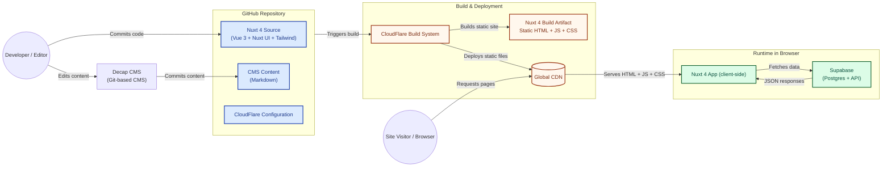

# Creadoras de Éxito - Team portal

Internal team portal for Creadoras de Éxito, providing centralized communication, resources, recognition, and scheduling.

## Decap CMS (Netlify CMS) Setup

This project uses **Decap CMS** to manage content for a **Nuxt 3 / public repo** site hosted on **Netlify**. Authentication is handled via **GitHub OAuth**, without Netlify Identity.

---

### 1. GitHub OAuth App Setup

1. Go to **GitHub → Settings → Developer settings → OAuth Apps → New OAuth App**.
2. Fill out the fields:

   | Field                      | Value                                            |
   | -------------------------- | ------------------------------------------------ |
   | Application name           | `Creadoras de Éxito CMS`                         |
   | Homepage URL               | `https://creadoras-de-exito-portal.netlify.app/` |
   | Authorization callback URL | `https://api.netlify.com/auth/done`              |
   | Application description    | Optional                                         |
   | Enable Device Flow         | Optional                                         |

3. Click **Register application**.
4. Copy the **Client ID** — this will be used in the CMS config as `app_id`.
5. Click the `Generate a new client secret` button
6. Make sure to copy the secret because you will not be able to view it again. It will be necessary when configuring Netlify OAuth (step 3).

> [!WARNING]
> The callback **must** be `https://api.netlify.com/auth/done`. Any other value will break GitHub login.

---

### 2. Disable Netlify GitHub OAuth (if previously enabled)

1. In the **Netlify Dashboard** → Projects → select site → **Project Configuration → Identity → External providers**.
2. Remove or disable any GitHub authentication provider.
3. Save changes.  
   This ensures the CMS uses the correct GitHub OAuth app.

---

### 3. Install GitHub OAuth Provider in Netlify Project

To allow the Decap CMS to authenticate via GitHub:

1. In the **Netlify Dashboard**, go to your **Project → Project configuration → Access & Security → OAuth**.
2. Click **Install provider → GitHub**.
3. Select **OAuth App** and enter:
   - **Client ID**: from your GitHub OAuth app (see step 1)
   - **Client Secret**: from your GitHub OAuth app
4. Set **Redirect URI**: `https://api.netlify.com/auth/done`
5. Save changes.

> [!WARNING]
> Make sure **Netlify Identity / GitHub integration is disabled**, or it will interfere with the CMS login.

---

### 4. Decap CMS Configuration (`/public/admin/config.yml`)

```yaml
backend:
  name: github
  repo: creadoras-de-exito/team-portal
  branch: main
  auth_type: implicit
  app_id: Ov23liBSRSBnxk8YsuSN

media_folder: 'public/uploads'
public_folder: '/uploads'

site_url: 'https://creadoras-de-exito-portal.netlify.app'
```

---

### 5. Admin Page (`/public/admin/index.html`)

```html
<!doctype html>
<html lang="en">
  <head>
    <meta charset="UTF-8" />
    <title>Creadoras de Éxito CMS</title>
    <meta name="viewport" content="width=device-width, initial-scale=1.0" />
    <!-- Load Decap CMS -->
    <script defer src="https://unpkg.com/decap-cms@^3.0.0/dist/decap-cms.js"></script>
  </head>
  <body>
    <div id="cms"></div>
  </body>
</html>
```

---

### 6. Deploy on Netlify

1. Push your changes to main branch.
2. Deploy your site on Netlify.
3. Open `/admin` on your site.
4. Click Login with GitHub → CMS loads → content is editable.

---

### 7. Notes / Troubleshooting

- Blank page? Make sure:
  - app_id matches the GitHub OAuth App
  - Callback URL is https://api.netlify.com/auth/done
- Public repositories do not need Netlify Identity
- Private repositories require proper GitHub OAuth App permissions.

---

### 8. Restrict CMS Access (Recommended)

To reduce exposure and ensure only authorized users can edit site content:

1. **Org-owned OAuth app**
   - Make sure the GitHub OAuth app for the CMS is owned by the `creadoras-de-exito` organization.
   - This ensures that only members of your org can authorize the app. Users outside the org will be denied access.
1. **Limit via Netlify GitHub OAuth App**

   Since the CMS uses **Netlify OAuth** for GitHub login:
   - The Netlify GitHub OAuth app controls which repositories can be accessed: **Settings → Third-party Access → Github Apps → Netlify**.
   - If the OAuth app is restricted to **`creadoras-de-exito/team-portal`**, CMS users can only read/write content in that repository.
   - Org membership is implicitly enforced — only GitHub users who can access the org and repo can log in successfully.

1. **Scopes**
   - Required: `repo` (read/write access to repository content)
   - Avoid granting extra scopes; the fewer the permissions, the lower the risk.
1. **Review and audit access**
   - Regularly check Organization → Settings → Authorized OAuth Apps.
   - Remove users who should no longer have access.
   - Audit GitHub logs for any unexpected activity.
1. **Repo restriction via CMS config**
   - In `config.yml`, point the CMS backend only to the repository you want the CMS to manage:
   - Even if a user authorizes the OAuth app, the CMS will only access this repository.

```yaml
backend:
  name: github
  repo: creadoras-de-exito/team-portal
  branch: main
  auth_type: implicit
  app_id: <YOUR_OAUTH_APP_CLIENT_ID>
```

> [!WARNING]
> GitHub does not provide per-repo restrictions directly in the OAuth app. The safest way to control access is by combining: org ownership + limiting scopes + pointing the CMS backend to a single repository.

---

### 9. High-Level Architecture



---

## Testing

### Playwright

Inside the root directory, you can run several commands:

- `npx playwright test` - Runs the end-to-end tests.
- `npx playwright test --ui` - Starts the interactive UI mode.
- `npx playwright test --project=chromium` - Runs the tests only on Desktop Chrome.
- `npx playwright test example` - Runs the tests in a specific file.
- `npx playwright test --debug` - Runs the tests in debug mode.
- `npx playwright codegen` - Auto generate tests with Codegen.
- `npx playwright show-report` - View dashboard for tests

## Cloudflare

### Create a new Worker project

Cloudflare CLI - https://developers.cloudflare.com/workers/get-started/guide/

```bash
npm create cloudflare@latest -- my-first-worker
```

- Hello world example
- worker only
- Typescript
- `Yes` to use GitHub
- `No` to deploy

## Package commands

Use for detailed information about packages used and that need updating

```bash
npx npm-check
```

Use for interactive update.

```bash
npx npm-check -u
```

Check for package updates

```bash
npx npm-check-updates
```

Update all packages

```bash
npx npm-check-updates -u
```

Using the ncu tool we can also detect which packages have newer versions:

```bash
ncu
```

To upgrade the “request” package to its newest major version, we could do the following:

```bash
ncu -u <package>
```

upgrade the `package.json` file

```bash
ncu -u
```
